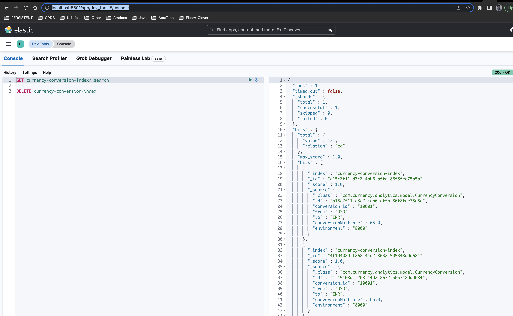

# API-Gateway

This is an API Gateway Service to route all calls to below respective services.

* [Currency-Conversion-Service](https://github.com/vvyavahare/currency-conversion-service)
* [Currency-Exchange-Service](https://github.com/vvyavahare/currency-exchange-service)
* [Currency-Analytics-Service](https://github.com/vvyavahare/currency-analytics)

## Complete architecture of the system


## Steps to setup project
1. #### Create directory in your system at your convenient location in filesystem.
```shell
mkdir currency
cd currency
```
2. #### [Clone all respective repositories](https://github.com/vvyavahare)
```shell
git clone git@github.com:vvyavahare/api-gateway.git
git clone git@github.com:vvyavahare/naming-server.git
git clone git@github.com:vvyavahare/currency-analytics.git
git clone git@github.com:vvyavahare/currency-conversion-service.git
git clone git@github.com:vvyavahare/currency-exchange-service.git
```

3. ####  [Make sure Docker is running locally](https://docs.docker.com/desktop/) Follow the steps from official docker 
   website to install docker desktop in your machine if not installed already. https://docs.docker.com/desktop/

4. #### [Run respective docker files to setup infrastructure](https://docs.docker.com/compose/) 
   * ##### Start Kafka Server : 
     Navigate to project currency-analytics project in your local file system in
     ```shell 
     cd currency-analytics/src/main/resources/docker-compose 
     ```
   
     Then run docker compose up command to start Kafka Server
     ```shell
       docker-compose -f kafka-cluster.yml up
     ```
     Note: If you are re-running application make sure to clean up all the previous kafka containers, you can use 
     below command to simply remove all stopped containers and again run above docker compose up command.
     ```shell
       docker system prune
     ```
   * ##### Start ElasticSearch and Kibana Server : 
      In the same directory (currency-analytics/src/main/resources/docker-compose) you can run docker compose command to start elasticsearch and kibana server.
     ```shell
      docker-compose -f elasticsearch-kibana.yml up
     ```
5. #### [Start individual applications](https://www.baeldung.com/spring-boot-run-maven-vs-executable-jar)
      * Start API-Gateway Service  
           ```shell
          cd currency/api-gateway
         ./mvnw spring-boot:run
           ``` 
      * Start Naming-Server Service
        ```shell
        cd currency/naming-server
        ./mvnw spring-boot:run
           ``` 
      * Start Currency-Exchange Service
        ```shell
        cd currency/currency-exchange-service
        ./mvnw spring-boot:run
           ``` 
      * Start Currency-Conversion Service
        ```shell
        cd currency/currency-conversion-service
        ./mvnw spring-boot:run
           ``` 
      * Start Currency-Analytics Service
        ```shell
        cd currency/currency-analytics
        ./mvnw spring-boot:run
           ``` 
6. #### [Test End to End flow](http://localhost:5601/app/dev_tools#/console)
    
   1. Either in postman or directly in browser hit below URL.
    ```http request
   http://localhost:8765/currency-conversion-feign/from/USD/to/INR/quantity/10
    ```
   2. This request goes via API-Gateway and using Naming Server resolves the host (Currency-Conversion-Service) to 
      which 
   current request should be forwarded.  
   3. In Currency-Conversion Service internally it calls Currency-Exchange service endpoint using feign to get actual 
      exchange rates and sends a kafka message to Currency-Analytics Service using topic "Currency-Conversion".
   
   4. Currency-Analytics Service listens to the same topic and logs that information into elasticserach into index "currency-conversion-index".
      We can view logged information in Kibana dashboard dev tools, Please find below snapshot for the same.

    