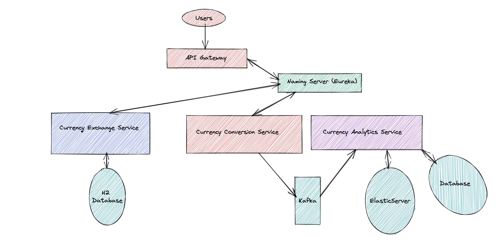

# API-Gateway

This is an API Gateway Service to route all calls to below respective services.

* [Currency-Conversion-Service](https://github.com/vvyavahare/currency-conversion-service)
* [Currency-Exchange-Service](https://github.com/vvyavahare/currency-exchange-service)
* [Currency-Analytics-Service](https://github.com/vvyavahare/currency-analytics)

## Complete architecture of System



## Steps to setup project
1. [Clone all respective repositories](https://github.com/vvyavahare)
```shell
git clone git@github.com:vvyavahare/api-gateway.git
git clone git@github.com:vvyavahare/naming-server.git
git clone git@github.com:vvyavahare/currency-analytics.git
git clone git@github.com:vvyavahare/currency-conversion-service.git
git clone git@github.com:vvyavahare/currency-exchange-service.git
```

2. [Make sure Docker is running locally](https://docs.docker.com/desktop/) Follow the steps from official docker 
   website to install docker desktop in your machine if not installed already. https://docs.docker.com/desktop/

3. [Run respective docker files to setup infrastructure](https://docs.docker.com/compose/) Navigate to directory in 
   your local machine as per below instructions 
   * Start Kafka Server : Navigate to project currency-analytics project in your local file system in
     currency-analytics -> /src/main/resources/docker-compose and run below command to start your kafka server 
     ``` docker-compose -f kafka-cluster.yml up ```
   
   * Start ElasticSearch and Kibana Server : In same directory you can run ``` docker-compose -f elasticsearch-kibana.yml up```